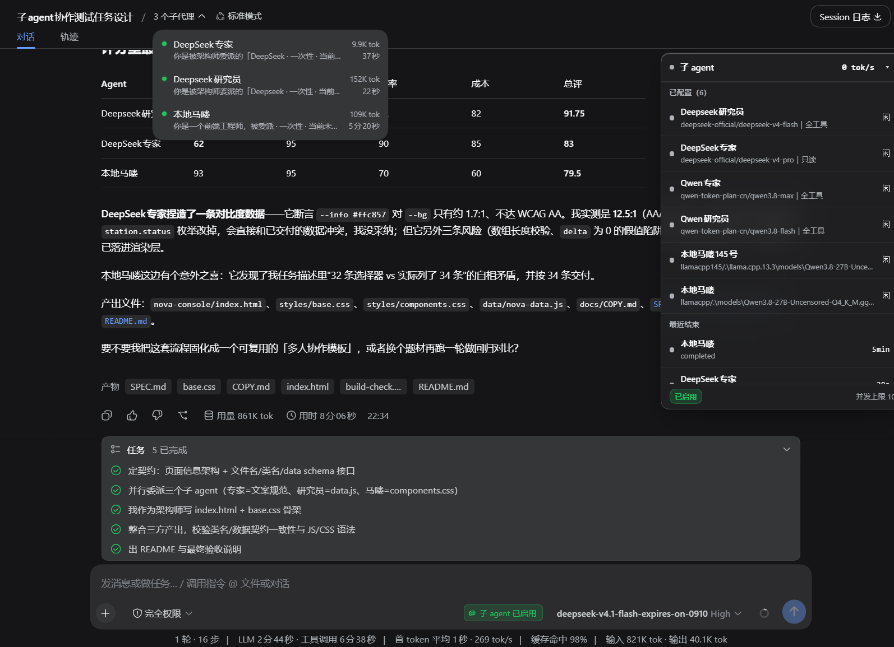
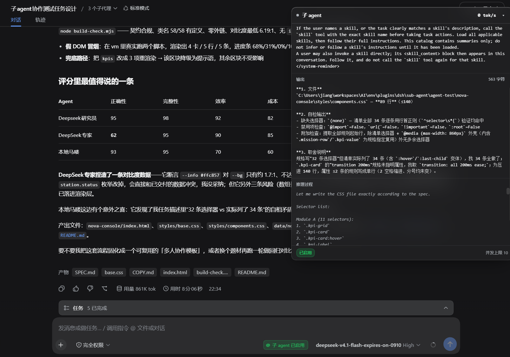

# dsh-subagent-hub — DSH 子智能体枢纽

把一个**你已经配好的模型**发布成可 `@`、可观测、可评价的**子智能体**，直接长在当前 DSH 页面上。

子智能体不是「另一个模型写的一段回答」，而是**真正的 DSH agent**：它跑在同一套 agent 运行时上，
有自己的会话、工具、文件系统与沙箱，只是把 `provider / model` 换成你在配置页里指定的那一个。

多步任务也不用手工串联：主对话建一条**任务清单**（含依赖），宿主负责「依赖完成就激活下游」，
面板与设置页把整条链路画成一张**依赖图**——见「任务清单与依赖图」。

---

## 长什么样

左侧是主对话，右侧是插件的悬浮球面板（已展开）。图是实际运行的截图，点开可看原尺寸。

**评分排名表** —— 面板列出全部已配置的子 agent（各自的模型与工具策略），并显示谁在跑、哪个已归档：

[](assets/screenshots/evaluation-boards.png)

**实时输出详情** —— 点开某次运行即进入详情：逐 token 输出、tool 调用与产出文件，底部可确认该次运行的状态：

[](assets/screenshots/run-detail.png)

> 图里的 agent 名、模型 ID 与评测分数都是真实运行产生的数据。本插件不附带任何预设配置，第一次打开时列表是空的。

---

## 版本兼容性（先读这一节）

本插件大量使用 DSH 的**内部**接口 —— `ctx.subagents.start`、`session/event` 的 `{global:true}` 语义、
客户端 bundle 的装配约定等。这些都**不是公开 API**，而 DSH 本体还处在 `0.x` 阶段，内部结构随时可能变。

| | |
| --- | --- |
| 开发并验证过的版本 | `@deepseek-ai/dsh@0.1.2-rc.1` |
| 声明兼容区间 | `>=0.1.2-rc.1 <0.2.0`（`package.json` 里写作 `peerDependencies` 的 `^0.1.2-rc.1`） |
| 区间外怎么办 | **仍然加载**，只警告。不会阻止你启动 |

**区间外只警告、不阻止**，是和插件的整体姿态一致的：它横跨 DSH 的多个子系统，
所以对每一项能力都用 `ctx.get()` 防御式取用 —— 取不到就关掉那项能力并**说清楚关了什么**，
而不是让整个插件起不来。版本不符时你会看到：

- **启动日志**一条醒目的警告（含检测到的版本、来源、声明区间）
- **`/sub-agent/api/health`** 里的 `harness` 字段

```powershell
curl.exe -sS http://127.0.0.1:3080/sub-agent/api/health
```

```jsonc
"harness": {
  "detected": "0.1.2-rc.1",        // 实际检测到的版本
  "source": "dsh entry",           // 从哪判出来的
  "tested": "0.1.2-rc.1",          // 本插件验证过的版本
  "supported": ">=0.1.2-rc.1 <0.2.0",
  "compatible": true,              // true 兼容 / false 超出区间 / null 无法判定
  "reason": null                   // 无法判定时说明原因
}
```

`compatible` 是**三态**的：`true` / `false` / `null`。`null` 表示**判不出来**——
DSH 没有把版本做成服务（已核实：没有 `ctx.get('version')`，`pluginInventory` 的 snapshot 也不带版本），
唯一可靠来源是磁盘上的 `package.json`。探测不到时它如实说「无法判定」并给出原因，
**不猜、也不假设通过** —— 把「不知道」折叠成 `true` 是在编造结论。

> 如果你在 `0.2.x` 或更高版本上使用，请先看 `/health` 的 `capabilities`：
> 某项是 `false` 就说明那个能力被自动关掉了。这时插件的行为是**降级并说明**，不是崩溃。

---

## 安装

> **本插件未发布到 npm。** 请按下面的方式从 GitHub 安装，`npm i dsh-subagent-hub` 这类命令不会成功。

从 GitHub 安装（需要本机有 `git`，pnpm 靠它取仓库）：

```powershell
dsh plugin --profile web add github:FlanceVoV/dsh-sub-agent
```

> `dsh plugin` 本质是 **pnpm 的薄封装**（它在 profile 目录里跑 `pnpm <args...>`，再按装出来的实际包名
> 对账 `dsh.profile.bundles`），所以 pnpm 认识的 spec 它都收：`github:` 简写、完整 git URL、
> tarball、`link:`/`file:` 本地路径。
>
> 等价的完整写法，以及锁定版本的写法：
>
> ```powershell
> dsh plugin --profile web add https://github.com/FlanceVoV/dsh-sub-agent.git
> dsh plugin --profile web add github:FlanceVoV/dsh-sub-agent#<tag 或 commit>
> ```
>
> 注意上面的 `#<tag 或 commit>` 是**你自己要填的**——本仓库目前**没有打过 tag**。
> 不写 `#…` 就是每次重装都拿最新的 `master`，介意漂移的话请先打 tag 再用。


从本地目录安装（二次开发时用，改完代码热更新）：

```powershell
dsh plugin --profile web add link:<本插件目录的绝对路径>
```

装完**必须重启一次 `dsh web`**：新的 loader entry 与客户端 bundle 都只在启动时装配。

重启后确认它活着：

```powershell
curl.exe -sS http://127.0.0.1:3080/sub-agent/api/health
```

返回 `ok:true` 且 `initError` 为 `null` 即正常。404 说明插件没被装配，
应检查 profile 的 `dsh.profile.bundles` 里有没有加上本插件。

顺手看一眼版本兼容性（见上一节）：

```powershell
curl.exe -sS http://127.0.0.1:3080/sub-agent/api/health
# 重点看 harness.compatible 与 capabilities 里有没有 false
```

卸载：

```powershell
dsh plugin --profile web remove dsh-subagent-hub
# 然后重启 dsh web
```

---

## 怎么用

### 1. 打开开关

在输入框那一行的 `@` 开关上启用。**这是全局开关，打开一次对所有对话生效**——
子 agent 的配置本来就是全局的（一张表、所有对话共用），开关的作用域必须和它一致。

开关状态走实时流：在任一窗口打开，其它窗口会立刻跟着变，不需要刷新页面。

### 2. 看悬浮球

启用后每个窗口右下角都会出现悬浮球：

- **收起**：显示谁在跑 + 实时 tok/s
- **展开**：列表（忙 / 闲、速率、最近结束）
- **点某一项**：进入详情页，看是哪个会话、实时输入输出

tok/s 带 `~` 前缀表示这是**估算值**（流式进行中只能按字符数推算）；
不带 `~` 的是权威值，由上一个已完成步骤的 token 用量算出。

### 3. 用 `@` 委派

在消息里直接写 `@名字`，或者打 `@` 从原生候选里选：

```
@研究员 查一下 X 的现状，给出可核对的结论
```

可以 `@` 多个——主对话会为每个名字各发起一次委派。

**忙的子 agent 不能被 `@`**，这条规则在三个地方体现：候选菜单里直接不出现、
悬浮球一直列着谁忙谁闲、以及工具边界的硬拒绝。UI 只是礼貌，规则在工具边界。

### 4. 读评分

主对话拿到子 agent 的产出后会按四个维度打分（正确性 / 完整性 / 效率 / 成本），
分数进入**排名表**与**跨轮回归表**。回归表用于比较同一任务在不同轮次的表现，
所以同一个任务应当复用同一个任务标识。

### 5. 看任务链路（依赖图）

多步任务不用你一步一步盯着：主对话会先把「任务清单 + 依赖」建出来（`subagent_plan`），
宿主负责**依赖完成就激活下游**，面板与设置页把整条链路画成一张依赖图。

```
t1 调研现状 ✓ ──▶ t2 按结论实现 ● ──▶ t3 独立评审 ⋯
                 （工程师 42 tok/s）      （审核员 等 t2）
```

**面板可以拖大**：右下角手柄自由缩放，标题栏的 `⤢` 一键放大/还原，尺寸记在本地。
图跟着**可用宽度**自适应——列数放得下就撑满、放不下才横向滚动；窄到 430px 以下
会自动换成上 → 下的纵向流水线（那个宽度里横向只能看到「第一个任务 + 半个第二个」）。

图上的分工是刻意的、只有两个通道：

| 你要看的信息 | 图上怎么看 |
| --- | --- |
| 任务处于什么状态 | 节点**底色 + 左侧色条 + 状态字**（已完成 / 运行中 / 可执行 / 等待依赖 / 被上游阻塞 / 失败 / 已取消） |
| 这条依赖解锁了没有 | 连线的**样式**：实线=上游已完成、流动虚线=上游正在跑、灰虚线=还没轮到（图例里画了真线做对照） |
| 并行分叉 | 同一层的任务**上下并排**在同一列；跨层的连线走「行间通道」绕过去——**没有任何一条线会压过别的任务方框** |

「等待依赖」与「被上游阻塞」是两个不同的状态，**不会混着显示**：
前者会自己好，后者不会——上游失败或取消时，下游会明确标成「被上游阻塞」，
并写出是哪个上游挂了。详情见下一节。

---

## 任务清单与依赖图（0.2.0）

一条**清单**（plan）是一组「任务 + 任务之间的依赖」。它解决的是子 agent 的两个天然缺口：
它们**看不到主对话**（因此不知道自己在整件事的哪一环），也**互相看不到**（因此拿不到上游结论）。

### 主对话怎么建

```
subagent_plan({
  title: "发布 0.2.0",
  tasks: [
    { id: "spec",   title: "调研现状", agent: "研究员", brief: "……完整任务说明……" },
    { id: "impl",   title: "实现与自测", agent: "工程师", brief: "……", deps: ["spec"] },
    { id: "review", title: "独立评审", agent: "审核员", brief: "……", deps: ["impl"] }
  ]
})
```

建单之后：没有依赖的任务**立刻**被激活，有依赖的先进入「等待依赖」。
`deps` 里写的是同一批或同一条清单里的任务 id（省略 id 时自动编号 `t1`、`t2`…）。

也可以让主对话用 `subagent_run({ task_id, plan_id })` 按任务派发——
这时 agent 与任务说明都由清单决定，你不需要（也不该）再写一遍 `prompt`。

### 谁在推这条链路

**宿主**在推。这不是省事，而是唯一可行的做法：主 agent 是一个回合制的模型，
它调用一次工具之后整个回合就阻塞在那次调用上，既看不到兄弟任务什么时候结束，
也无法在两次调用之间「守着」；而依赖完成是一个**事件**，事件必须有常驻的东西来收。

所以分工是：

| 谁 | 负责什么 |
| --- | --- |
| 宿主（本插件） | 监听运行结束事件、重算「现在谁可执行」、按分层顺序激活下游、把每次推进写进日志 |
| 主对话 | 建清单、读链路现状（`subagent_tasks`）、必要时手动激活 / 重试 / 取消 |
| 面板 / 设置页 | 画图：谁在跑、谁完成、谁在等谁、谁被卡住；面板还有「继续 N 项」一键放行 |

### 「子 agent 没跑完，主对话就结束了」怎么办

这是这类链路最容易踩的坑：主对话的**回合**是唯一在等它的东西，回合一结束，
下游任务就没人推了。所以这里做了四层，从「尽量不让它发生」到「发生了也能救回来」：

1. **`subagent_plan` 默认等整条链路跑完**（`wait_for_chain`，有界超时，返回时连带各任务的产出摘要）。
   这是第一道也是最主要的一道：只要主对话正常用它建清单，就不会中途撒手。
2. **钉住父 agent 实例**。自动激活要用一个活着的父 agent，而它平时只有「工具调用的那一刻」能拿到；
   拿到过一次就记在内存里复用——于是主对话离开之后，**已经在跑的链路仍然能自己往下走**。
   （父 agent 真正消失时——比如会话被关掉——才会退回按会话查找。）
3. **主对话回到会话时自动续跑**：该会话出现新的用户消息，宿主就重新评估这条链路里有没有可执行的任务。
4. **面板/设置页的「继续」按钮**：人手兜底。停在「可执行」的任务，点一下就放行。

另外，**每次装配提示词时都会把未完成链路的现状写进系统提示词**
（进度、运行中/可执行/等待/被阻塞、以及卡住的原因），所以主对话下次醒来时不会
「不知道刚才那条链路跑哪了」，也不会重复派发。

清单级 `auto_activate: false`（或全局配置 `taskAutoActivate: false`）时，宿主**只把任务标成「可执行」**，
一个都不启动，等你（或主对话）手动放行。这是控成本的开关。

### 子 agent 怎么看这份清单

三层都给了，按「拿不到也不需要额外请求」的顺序排：

1. **派发时注入提示词**（一定生效）：任务说明、链路全貌、**上游产出**、
   以及「你的产出会被直接交给下游」这条约束。子 agent 之间不共享上下文，
   所以上游结论只能靠这段文字带过去——不注入的话，「流水线」就退化成几次互不相干的调用。
2. **`subagent_tasks` 工具（只读）**：被委派的子 agent 可以调它，
   看到自己在这条链路里的位置、下游在等什么。**写操作会被拒绝**——
   任务清单的推进权属于调度者，否则 A 任务可以取消 B 任务。
3. **HTTP 只读端点**：`GET /sub-agent/api/tasks/<plan_id>`（提示词里会带上完整地址，端口探测不到时就不写）。

### 状态语义

| 状态 | 含义 | 会自己变吗 |
| --- | --- | --- |
| `waiting` 等待依赖 | 依赖还没完成，不能派发 | 会（依赖完成后变「可执行」） |
| `ready` 可执行 | 依赖已全部完成，等待被激活 | 会（激活后变「运行中」） |
| `running` 运行中 | 已派发（含排队；`runStatus` 会区分排队与真在跑） | 会（结束后进终态） |
| `done` 已完成 | 运行成功结束 | 不会 |
| `failed` 失败 | 运行失败 / 超时 / 被取消 | 不会（除非重试） |
| `blocked` 被上游阻塞 | 上游有失败或取消的任务，本任务永远不可能就绪 | 不会（除非重试上游） |
| `cancelled` 已取消 | 人工取消了这项任务 | 不会（除非重试） |

**状态是算出来的，不是存下来的。** 库里只存事实（`run_id` / `run_status` / `cancelled_at`），
状态每次读取时由 `lib/src/plan.js` 现算。存下来就会有两个真相来源，
而进程被杀、事件丢失、手工改库都会让它们分叉——分叉的表现是「图上说在跑、链路却不动」。

### 校验：建单时就挡住必然会卡住的清单

| 会被拒绝的情况 | 为什么必须在这里拒绝 |
| --- | --- |
| 依赖成环 | 环上的任务互相等待，永远不会就绪（错误里会给出**具体的环路径**） |
| `agent` 不是已配置的子 agent | 写错的名字不会有人来接这一棒，任务会永远停在「等待激活」 |
| 任务 id 重复 / 依赖指向不存在的任务 | 依赖靠 id 指认，重名与悬空都会让依赖有歧义 |
| 超过 64 项任务 | 一条链路要能一眼看懂，装不下的应当拆成多条清单 |

### 已知边界（都是真的）

1. **链路需要一个活着的父 agent 或一个活着的会话。** 自动激活要拿父 agent 实例；
   拿不到就**不启动**，把原因写进清单（界面上能看到「为什么这条链路卡住了」），
   而不是假装启动成功。补救路径见上一节的四层（钉住实例 / 回会话续跑 / 面板「继续」）。
2. **主对话不会被主动打断通知。** 自动激活发生在没有工具调用的时刻，
   没有任何通道能往主对话里推消息。所以「链路跑到哪了」靠主对话主动调 `subagent_tasks`——
   提示词里每轮都会带上未完成链路的现状，工具输出里也会带链路摘要。
3. **自动激活是真实花费。** 主对话建清单＝授权这条链路自己走完。
   想保留人工闸门就用 `auto_activate:false`，或把全局的 `taskAutoActivate` 关掉。
4. **自动激活不套用 `maxParallelPerSession`。** 那条限制是给「一次对话里手抖 @ 太多」用的；
   一条清单里的并行度是它自己的设计意图，套上去会让宽链路无故卡住。
   真实并发仍由 `maxConcurrentRuns` 一处管（超出排队，不会失败）。
5. **注入的上游产出是**有界的**。** 每依赖上限 `taskUpstreamChars`（默认 2000 字符），
   超出部分只留 run 引用——不设闸的话，一条长链路会因为上游正文越滚越长而炸上下文。
6. **等整条链路是有上限的**：`subagent_plan` 的等待到点就返回，并明确告诉你「还在跑」，
   不会假装完成（长链路请用 `subagent_tasks` 跟进，或者显式传 `timeout_ms`）。
7. **删清单不删运行记录。** 清单与任务是「计划」，运行与评价是「台账」，
   删除清单不会抹掉历史（反之，`retentionDays` 清理运行记录时，任务上仍留着状态快照）。

---

## 配置子 agent

设置 →「子 agent」。同一个模型可以添加多次（例如同一个模型分别配「全工具」和「只读」两个角色）。

| 字段 | 说明 |
| --- | --- |
| 名称 | `@` 的句柄，**必须唯一**（归档后重名的会被拒绝） |
| agent 提供商 | 子 agent 的传输实现；只有支持 `agentOptions` 的才会出现在这里 |
| 模型提供商 | 模型路由（已激活的、有模型清单的排在前面） |
| 模型 ID | 该路由下的模型；换提供商时会同时重新选模型 |
| 模型最大上下文 | **本插件的输入预算闸**，见下 |
| 单次输出上限 | 传给模型的单次输出 token 上限 |
| 工具策略 | 继承父级（全工具）/ 只读（fail-closed 白名单）/ 无工具 |
| 推理档位 | 留空 = 用模型默认 |
| api 地址 | 留空 = 用 DSH 该路由的配置 |
| 凭据引用 | 留空 = 用该路由的默认凭据；只报「配没配」，不显示值 |
| 备注 | 可选 |
| 人格 / 系统提示词 | 可选，留空则沿用 DSH 的默认人格 |

**归档不是删除**：归档只把配置从 `@` 候选里移走，历史运行与评价都还在，
设置页底部有「已归档」区块可以**恢复**。恢复时如果名字已被新配置占用会如实拒绝。

> ⚠ 「模型最大上下文」**不是模型窗口**。`AgentOptions` 只有
> `{provider, model, reasoningEffort, maxTokens}`，没有上下文窗口字段，
> 窗口是模型目录的属性，无法按子 agent 单独调小。
> 所以这个字段被诚实地用作**本插件的输入预算闸**：预估超限就拒绝启动并说明原因，
> 而不会假装改了模型窗口。

---

## 运行护栏

设置 →「子 agent」→「运行护栏」。改动立刻生效并写进用户层配置文件。

| 键 | 默认 | 含义 | 能否热改 |
| --- | --- | --- | --- |
| `maxConcurrentRuns` | 2 | 同时最多几个子 agent（真实费用护栏），超出**排队**而不是失败 | ✅ |
| `maxParallelPerSession` | 3 | 同一父会话同时最多被 `@` 几个 | ✅ |
| `runTimeoutMs` | 900000 | 单次运行上限，到时取消并记为 timeout | ✅ |
| `outputTailChars` | 20000 | 运行记录里保留的输出正文上限 | ✅ |
| `retentionDays` | 0 | 运行记录保留天数，0 = 永久 | ✅ |
| `tokPerSecondWindowMs` | 3000 | 速率采样窗口 | ✅ |
| `readonlyToolAllow` | `[]` = 内置默认 | 「只读」策略的白名单 | ✅ |
| `taskAutoActivate` | true | 新建任务清单时「依赖完成自动激活下游」的默认值（逐条清单可覆盖） | ✅ |
| `taskUpstreamChars` | 2000 | 注入下游提示词的上游产出字符上限（每个依赖各算一次） | ✅ |
| `dbPath` | 空 = `$DSH_HOME/subagent-hub/subagent-hub.db` | sqlite 路径 | 需重启 |
| `logToStdout` | true | 是否把插件日志接到 stdout | 需重启 |

**配置来源**，后者覆盖前者：内置默认值 → `cordis.patch.yml` 的 `config`（部署层）→
`$DSH_HOME/subagent-hub/config.json`（用户层）。

写配置的姿态是刻意不对称的：**读**的宽容降级（未知键打 warning 并保留默认值，
配置写错不该让插件起不来），**写**的严格拒绝（写下去的东西会持久化，
静默纠正一个写错的值等于把错误固化）。

「需重启」的项在界面里显示为禁用并说明该改哪个文件，**不会假装保存成功**。

调大 `maxConcurrentRuns` 后**已经排队**的任务会立刻被放行——否则用户看到的会是「改了没用」。
护栏区块里显示的「排队中 N」就是让这件事看得见。

---

## 数据

`$DSH_HOME/subagent-hub/subagent-hub.db`（sqlite，用 Node 内置的 `node:sqlite`，无需额外依赖）。

表：`agents` / `runs` / `rounds` / `evaluations` / `settings` / `plans` / `tasks`。

**只存有界输出正文**（`outputTail`，默认 2 万字符），更长的正文靠 `session_id`
回查 DSH 自己的会话日志——本插件刻意**不复制对话正文**，只存指针。

任务清单**不存任务状态**（只存 `run_id` / `run_status` / `cancelled_at` 这些事实），
原因见「任务清单与依赖图」一节。

数据库带 `application_id = 0x53554241`（`'SUBA'`）：**拿错文件会直接拒绝打开**，
绝不往别人的库里写。

**升级是自动的**：`0.1.x` 的库（schema v1）在 `0.2.0` 首次启动时会被补建 `plans` / `tasks`
两张表并升到 v2（只加表，幂等），启动日志里会打一行 `数据库 schema 已升级：v1 → v2`。

---

## API

前缀 `/sub-agent/api`，是宿主与面板之间的唯一接口。

| 方法 | 路径 | 用途 |
| --- | --- | --- |
| GET | `/health` | 存活、能力自检、DSH 版本与兼容性（`harness`） |
| GET | `/state?sessionId=` | 当前状态（含 `agents`、`archivedAgents` 与 `tasks` 任务图） |
| GET | `/stream` | SSE 实时流（常开；任务图变化会**立刻**补发一帧） |
| POST | `/enable` | 开关 |
| GET / PATCH | `/config` | 运行护栏 |
| POST | `/model-detail` | 查某个模型的推理档位等细节 |
| GET / POST | `/agents` | 列表 / 新建 |
| PATCH / DELETE | `/agents/:id` | 修改 / 归档 |
| POST | `/agents/:id/restore` | 从归档恢复 |
| GET | `/runs` | 运行记录列表 |
| POST | `/run` | 直接发起一次委派 |
| GET | `/runs/:id`、`/runs/:id/detail` | 运行摘要 / 详情（增量） |
| POST | `/runs/:id/cancel` | 取消 |
| GET | `/runs/:id/evaluations` | 该次运行的评价 |
| POST | `/evaluate` | 打分 |
| GET | `/leaderboard`、`/regression` | 排名 / 跨轮回归 |
| GET / POST | `/rounds` | 轮次 |
| GET | `/tasks` | 全部任务清单（含任务说明与依赖边，面板画图的数据源） |
| POST | `/tasks` | 建一条清单（body：`{title, note?, autoActivate?, tasks[]}`） |
| GET | `/tasks/:planId` | 单条清单的依赖图与状态 |
| PATCH | `/tasks/:planId` | 只支持 `{autoActivate}`（改名会让链路与回归对不上，故不开放） |
| DELETE | `/tasks/:planId` | 删清单（运行记录与评价保留） |
| POST | `/tasks/:planId/tasks` | 往清单里追加任务 |
| POST | `/tasks/:planId/activate` | 激活（body 可带 `{taskId}` 只激活一项） |
| POST | `/tasks/:planId/cancel` | 取消这条清单里所有未完成的任务 |
| POST | `/tasks/:planId/:taskId/activate\|retry\|cancel` | 单项任务操作 |

**任务 id 是清单内唯一的**，所以任务相关的路径一律把 `planId` 放在前面：
模型写的依赖可以是最短的 `t3`，而 HTTP 这一层没有歧义。

模型侧另有五个工具：`subagent_run`、`subagent_evaluate`、`subagent_roster`、
`subagent_plan`（建清单）、`subagent_tasks`（看/推清单，子 agent 可读）。

---

## 日常开发

```powershell
node scripts/build-client.mjs         # 把 lib/parts/*.js 拼成 lib/client.js
node scripts/build-client.mjs --check  # 只校验「产物 == 分片」
node --test "tests/*.test.mjs"        # 单元 + 集成（假 DSH 上下文跑通全链路）
node scripts/verify-client.mjs        # 用真 React 加载并 SSR 渲染客户端 bundle
node scripts/dev-server.mjs           # 真 HTTP + 真 sqlite 的离线宿主（127.0.0.1:8791）
node scripts/check-publish.mjs        # 体检：扫绝对路径 / 用户名 / 密钥痕迹
node scripts/pack.mjs                 # 自检 → 打包 → 列出包内容
```

改宿主代码时优先用 `dev-server` 或集成测试验证，**不要**为了试一次就重启 DSH。

### 客户端源码的读写规则

客户端 bundle 必须是**单文件**（DSH 的客户端模块系统只暴露少量种子模块），
所以源码放在 `lib/parts/*.js`（按文件名顺序拼接），`lib/client.js` 是**构建产物**。

**分片是唯一的真相来源。** 契约测试会重算并比对，直接改产物会让测试立刻变红，
提示你「改分片，然后跑构建」。

**排序有语义，不只是好看**：拼接结果是一个函数体，`01-head.js` 打开工厂、
中间各片只放声明、**最后一片 `05-settings-tail.js` 负责收尾**（关掉工厂并一次性列出 `exports.*`）。
新分片的文件名必须排在收尾片**之前**，否则它的顶层代码会落在工厂外面——
症状是 `ReferenceError: exports is not defined`（0.2.0 加链路图时踩过这一次）。

`lib/parts/*.js` 单独看不构成合法 JS（第一片开 factory，最后一片才收尾），
所以对它们跑 `node --check` 会报错——这是预期，不是问题。同理，
改完 `lib/parts/*.js` **必须**跑一次 `build-client.mjs`。

### 热更新边界

| 改了什么 | 生效方式 |
| --- | --- |
| `lib/parts/*.js` + `build-client.mjs` | 热更新（不用刷新页面） |
| `lib/host.js`、`lib/src/*.js` | **需要重启 `dsh web`** |
| `cordis.patch.yml`、`package.json` 的 `dsh` 字段 | **需要重启 `dsh web`** |

---

## 排错

### 「`dsh web` 卡住了」

通常**不是卡住**。`dsh web` 是前台服务器，启动时打完那两行就不再输出，
在你按 Ctrl+C 之前它一直占着终端——「没有新输出」和「死住了」看起来一样。

按这个顺序判断它是活的还是死的：

```powershell
# 1. 服务是不是真的在应答（这条最决定性）
curl.exe -sS http://127.0.0.1:3080/sub-agent/api/health

# 2. 每个客户端 bundle 是否都送得出去（都该是 200）
curl.exe -sS http://127.0.0.1:3080/plugins/events

# 3. 端口有没有被监听
Get-NetTCPConnection -LocalPort 3080 -State Listen
```

1 和 2 都正常就说明**服务是好的**，问题在终端或浏览器那一侧：

- **Windows 控制台 QuickEdit**：在窗口里点一下（比如为了选中文字去复制）会让控制台进入选择模式，
  进程输出被**暂停**，看起来就是「卡死」。按 `Esc` 或 `Enter` 退出即可。
  根治办法：窗口标题栏右键 → 属性 → 取消勾选「快速编辑模式」。
- **浏览器页面本身**：如果标签页是空白的，看它自己的控制台——服务端 bundle 都是 200 的话，
  问题在页面内，不在宿主。

### 插件路由全部 404

先确认你挂在哪个 profile 上：

```powershell
Get-CimInstance Win32_Process -Filter "Name='node.exe'" | ForEach-Object { $_.CommandLine }
```

`safemode` 是**救援 profile，设计目标就是零第三方插件**——在那个 profile 下，
本插件与所有第三方插件的路由都会 404，`/` 还会要求登录，**那不是插件坏了**。
回到正常工作状态就是重新跑 `dsh web`（即 `web` profile）。

### 「能打开，但有些功能是空的 / 不出现在界面上」

先查这两处，它们的顺序不能反：

```powershell
curl.exe -sS http://127.0.0.1:3080/sub-agent/api/health
```

1. **看 `harness.compatible`。** 如果是 `false`，说明 DSH 版本超出了已验证区间
   （`harness.detected` 是实际版本）——这是最可能的原因。
2. **看 `capabilities` 里哪一项是 `false`。** 每一项对应一个 DSH 服务：
   `subagents` / `agents` / `tools` / `systemPrompt` / `llm` / `settings` / `credentials` / `sessions`。
   某一项为 `false` 就是某项能力被自动关掉了，而对应用户可见的症状是固定的：

| 能力 | 关掉之后你会看到 |
| --- | --- |
| `subagents` | `@` 委派跑不起来，悬浮球永远没有任务 |
| `tools` | 主对话**看不到** `subagent_run` 等三个工具（面板仍能用） |
| `systemPrompt` | `@` 的注入协议段没进系统提示词，主对话不知道该怎么处理 `@` |
| `credentials` | 配置页的凭据引用拿不到状态 |
| `llm` / `settings` / `sessions` | 模型清单、设置读写、会话查询相应降级 |

`harness.compatible` 是 `null` 则表示**无法判定版本**（`harness.reason` 会说明原因）——
这时不要据此认为兼容，去看 `capabilities` 的实际结果。

**任务链路那块是空的？** 三种情况分得清，别混着猜：

1. **还没建过清单**（最常见）：面板根本不渲染任务区块，设置页的区块里会说明怎么建
   （主对话用 `subagent_plan`）。它不是错误，是空状态。
2. **宿主没装配任务服务**：启动日志里会有一条 `任务清单服务未启用（@ 委派与面板不受影响）`，
   模块级工具也不会注册。这通常意味着存储没起来——先看 `/health` 的 `initError`。
3. **清单建了但一个都没跑**：卡片上会写明原因（`activationError`），
   例如「任务 a 未能启动：ctx.subagents 不可用」。这是**如实降级**，不是链路的静默失败。

### 关于终端日志

`logToStdout`（默认开）在**宿主启动时**会往 stdout 打一行本插件的信息。
它**只打本插件自己的**：cordis 的 exporter 是全局的，不过滤就会把所有插件的日志都灌进终端。

---

## 目录

```
lib/host.js            生命周期与装配（无领域逻辑）
lib/src/store.js       sqlite：agents / runs / rounds / evaluations / settings / plans / tasks
lib/src/discovery.js   自发现：路由、模型、窗口、传输、凭据（只问状态不问值）
lib/src/registry.js    校验与翻译：配置 → AgentOptions / ToolRestriction（纯逻辑）
lib/src/plan.js        任务清单的纯逻辑：校验、环检测、状态派生、分层（零依赖，可穷举测试）
lib/src/tasks.js       任务清单的应用服务：建清单、激活任务、监测依赖完成
lib/src/runtime.js     运行时：起子 agent、折遥测、守并发与超时
lib/src/tools.js       模型侧入口：五个工具 + 系统提示词协议段
lib/src/http.js        JSON + SSE 接口层
lib/src/version.js     DSH 版本探测与兼容性判定（零 DSH 依赖，只读 package.json）
lib/parts/*.js         客户端分片（唯一真相来源；01 head → 04 链路图 → 05 收尾）
lib/client.js          客户端 bundle（构建产物，勿手改）
tests/                 单元 / 集成测试
scripts/               build-client / verify-client / dev-server / check-publish / pack
assets/screenshots/    README 用的界面截图（仅供展示，不参与构建与打包）
```

## 变更

- **0.2.0**：任务清单与依赖图。新增 `plans` / `tasks` 两张表（schema v1 → v2，自动升级）、
  `plan.js` 与 `tasks.js` 两个模块、`/tasks` 系列端点、`subagent_plan` / `subagent_tasks` 两个工具、
  `subagent_run` 的 `task_id` 绑定、面板与设置页的链路图（客户端第 4 片 `04-task-graph.js`）。
  另外把「请求体不是合法 JSON」的状态码从 500 改成 400（那是客户端错误，不是服务端故障）。
  同版内的三处修正（都是看了实际渲染/真机反馈之后改的）：
  - **图改成横向（左 → 右）为主 + 自适应**：并行分叉上下并排、跨层连线走行间通道不压节点方框、
    面板可拖拽缩放（右下角手柄 + `⤢` 一键放大）、窄到 430px 以下才退回纵向。
  - **修掉「深色主题下节点文字看不见」**：SVG 文字默认是黑色，而节点底色用的是主题的
    `bg-layer-1`，深色下就是深底黑字。现在显式给 `fill:currentColor` 跟随主题。
  - **补掉「子 agent 没跑完、主对话已结束」这个设计缺口**：`subagent_plan` 默认等整条链路跑完、
    钉住父 agent 实例、主对话回到会话时自动续跑、面板加「继续」按钮、提示词每轮带上未完成链路现状。
- **0.1.0**：首个功能版本（悬浮球、`@` 委派、配置页、评价与跨轮回归）。

## 已知限制

1. **「模型最大上下文」不是模型窗口**，只是本插件的输入预算闸（见上）。界面上也这么写。
2. **只保留有界输出正文**：运行记录里存 `outputTail`（默认 2 万字符），
   更长的正文靠 `session_id` 回查 DSH 的会话日志。这是刻意的，不复制权威副本。
3. **改宿主代码需要重启 `dsh web`**（DSH 的 HMR 不监听模块路径）。客户端改动是热更新的。
4. 本插件走**一次性运行**，不支持续聊路径。
5. **任务链路的推进靠宿主在跑**，所以它需要一个活着的父会话；会话关掉之后，
   已建好的链路会停在原地（原因写在清单上），可以手动激活或重试（见「已知边界」）。
6. **主对话不会被打断通知**：自动激活发生在两次工具调用之间，没有推送通道。
   看链路现状要主动调 `subagent_tasks`（工具输出里也会带链路摘要）。
7. **版本兼容性是已知的真实风险**：本插件针对 `@deepseek-ai/dsh@0.1.2-rc.1` 开发，
   依赖的是 DSH 的内部接口。区间外的版本会加载但可能降级 —— 见「版本兼容性」一节，
   以及 `/sub-agent/api/health` 的 `harness` 与 `capabilities` 字段。

> 界面截图拍摄于 `0.1.0`，因此不包含 `0.2.0` 的任务链路图。
> 仓库里只放**真实运行**产生的截图，不补画示意图。
